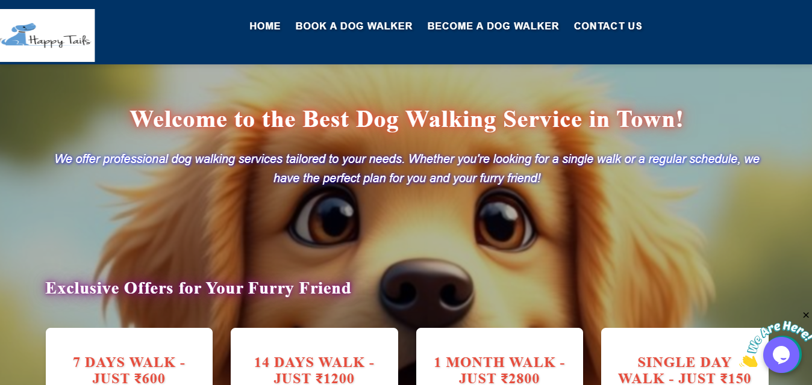
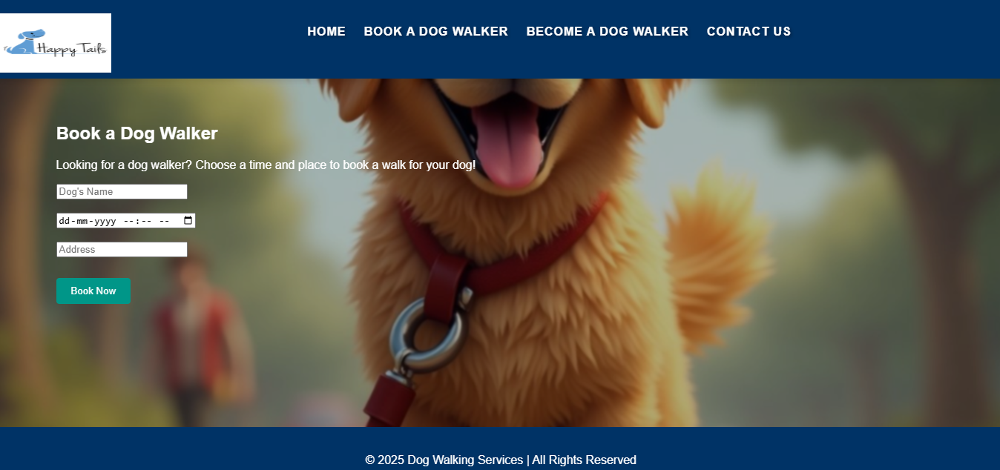
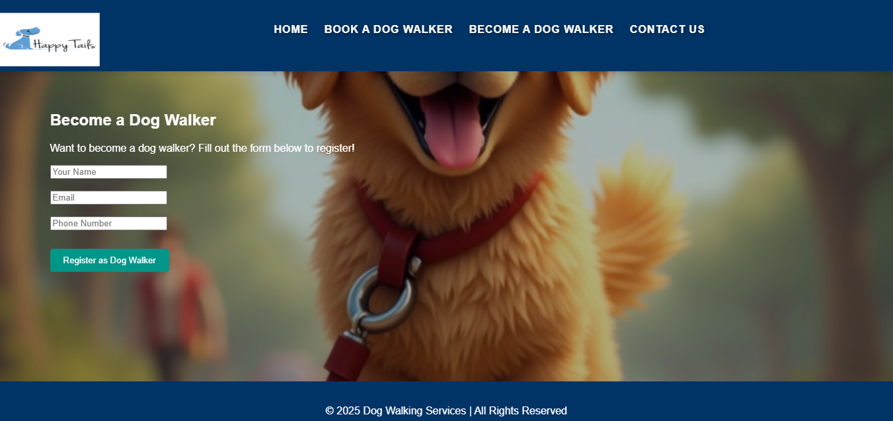

# 🐶 Happy Tails – Dog Walking Services Website

## 📖 Overview

**Happy Tails** is a responsive web application developed to connect pet owners with dog walkers through a simple, intuitive, and user-friendly interface. The platform offers two primary services:

- 🐕 **Book a Dog Walker** – Enables pet owners to schedule dog walking appointments by providing their dog's details, preferred date, time, and address.
- 🚶 **Become a Dog Walker** – Allows individuals to register as professional dog walkers through an online registration form.

To enhance user experience, the website also features an **AI-powered chatbot** that assists users with website navigation and answers basic service-related queries.

---

## ✨ Features

- 🐕 Book a Dog Walker service
- 🚶 Become a Dog Walker registration
- 🤖 AI-powered chatbot for user assistance
- 📅 Online appointment booking
- 📝 Dog walker registration form
- ✅ Client-side form validation using JavaScript
- ⚙️ PHP-based form processing
- 📱 Responsive web design
- 🎨 Clean and user-friendly interface
- 🧭 Easy website navigation

---

## 🛠️ Technologies Used

- HTML5
- CSS3
- JavaScript
- PHP
- Responsive Web Design

---
## 📸 Screenshots

### Home Page



### Book a Dog Walker



### Become a Dog Walker



## 📂 Project Structure

```text
Happy-Tails/
│
├── css/
├── js/
├── php/
├── images/
├── assets/
├── Documentation/
│   └── Happy_Tails_Project_Report.pdf
├── Screenshots/
├── index.html
├── README.md
├── LICENSE
└── .gitignore
```

---

## 🚀 How to Run

1. Download or clone the repository.

```bash
git clone https://github.com/devtusharhq/happy-tails-dog-walking-services.git
```

2. Open the project folder.

3. If using PHP, place the project inside your local server directory (e.g., **XAMPP htdocs** or **WAMP www**).

4. Start **Apache** from your local server.

5. Open your browser and visit:

```text
http://localhost/happy-tails/
```

6. Explore the available services and website features.

---

## 📸 Website Modules

### 🐶 Book a Dog Walker

Allows pet owners to schedule a dog walking appointment by entering their dog's details, preferred date and time, and address.

### 🚶 Become a Dog Walker

Allows interested individuals to register as professional dog walkers by submitting their personal information through a registration form.

### 🤖 AI Chatbot

Provides instant assistance by helping users navigate the website and answering basic service-related queries.

---

## 🎯 Learning Outcomes

This project helped strengthen my understanding of:

- Responsive Web Design
- HTML5 & CSS3
- JavaScript Form Validation
- PHP Form Handling
- User Interface (UI) Design
- Website Navigation
- Basic AI Chatbot Integration
- Front-end and Back-end Integration

---

## 🚀 Future Enhancements

- Booking confirmation notifications
- Location-based service integration
- User profile management
- Service ratings and feedback
- Mobile-friendly enhancements

---

## 📄 Documentation

The repository includes:

- Complete source code
- Project report
- Website screenshots
- README
- MIT License
- .gitignore

---

## 👨‍💻 Developed By

**Tushar L. Devendra**

B.Sc. Information Technology  
SVKM's Usha Pravin Gandhi College (Mumbai University)

### 🔗 GitHub

https://github.com/devtusharhq

---

## ⭐ Support

If you found this project useful, consider giving it a ⭐ on GitHub.
